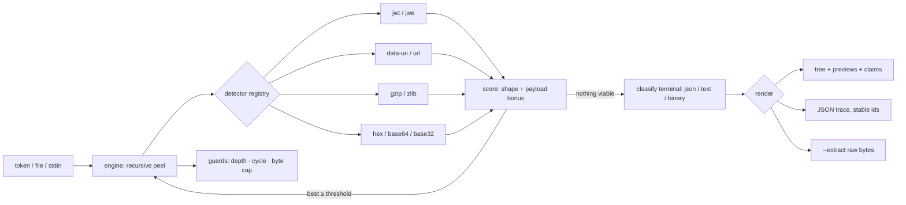

# peelback

[English](README.md) | [中文](README.zh.md) | [日本語](README.ja.md)

[](LICENSE) [](pyproject.toml) [](CHANGELOG.md)  [](CONTRIBUTING.md)

**peelback：不透明なトークンから base64・hex・gzip・URL・JWT の層を再帰的に剥がす、オープンソースでゼロ依存の CLI ＆ライブラリ——自動検出・信頼度スコア付き・完全オフライン。**


```bash
git clone https://github.com/JaydenCJ/peelback && cd peelback
pip install .    # pure standard library — nothing else comes with it
```

> プレリリース：v0.1.0 はまだ PyPI 未公開です。上記のとおりソースからインストール（Python ≥3.9 なら可）するか、インストールせず `PYTHONPATH=src python3 -m peelback` で実行してください。

## なぜ peelback？

インシデント対応で手元に降ってくるトークン——セッション Cookie、OAuth の `state` パラメータ、webhook 署名、キャッシュキー——が*一層*だけの符号化で済んでいることは稀です。実態は玉ねぎ：JSON が gzip され、base64url され、最後に経路上のどこかのプロキシがパーセントエスケープを重ねます。手元の道具は一度に一歩しか進めません。`base64 -d` は URL セーフな字母や剥がされたパディングで詰まり、`xxd -r` は「これは hex だ」と既に分かっている前提で、しかも一歩ごとに出力を目視して次のコマンドを当てる羽目になります。CyberChef の「Magic」レシピは推測を自動化しますが、住処はブラウザのタブ——本番の資格情報を Web ページに貼るのはトークン漏洩の定番ルートです。peelback はこのループを 1 本のオフラインコマンドにしました。blob に 8 つの検出器を走らせ、入力の形状*に加えて*デコードがどれだけ構造を露わにしたかで各候補を採点し、勝者を剥がして再帰、本物の中身に届くまで続けます——全過程を層ごとの信頼度付きツリーとして表示し、JWT クレームには注釈が付き、任意ノードの生バイトは `--extract` 一発で取り出せます。同じくらい大事なのは「拒否するもの」：UUID・数値 id・普通の単語は素朴なデコーダにとってはどれも「正しい」base64 や hex ですが、peelback のスコアリングはそれらをゴミバイトに砕かず、そのまま残します。

| | peelback | `base64 -d` / `xxd -r` | CyberChef "Magic" | jwt.io |
|---|---|---|---|---|
| 入れ子の層を自動で剥がす | ✅ 再帰・自動検出 | ❌ 一歩ずつ手動選択 | ✅ | ❌ JWT のみ |
| 単語型の誤検出を拒否 | ✅ 信頼度スコア | ❌ 何でもデコード | ⚠️ ヒューリスティックでノイジー | n/a |
| JWT 構造＋クレーム注釈 | ✅ header/payload/signature | ❌ | ⚠️ レシピを手組み | ✅ |
| 解凍爆弾ガード | ✅ 出力ハードキャップ | ❌ | ⚠️ ブラウザのメモリ頼み | n/a |
| 機械可読なトレース | ✅ `--json`、安定ノード id | ❌ | ⚠️ 手動エクスポート | ❌ |
| 実物の資格情報にも安全 | ✅ オフラインのローカルプロセス | ✅ | ❌ ブラウザに貼る | ❌ ブラウザに貼る |
| ランタイム依存 | 0 | coreutils | Web アプリ | Web アプリ |

<sub>比較確認 2026-07-13：peelback が import するのは Python 標準ライブラリのみ。`base64`/`xxd` は単段デコーダ。CyberChef と jwt.io はブラウザツールでシェル終了コードを持ちません。</sub>

## 特徴

- **再帰的な自動検出** — 8 つの検出器（JWT/JWE、`data:` URI、gzip、zlib、パーセント符号化、hex、base64/base64url、base32）が全階層で走り、最高スコアのデコードを剥がして結果を再投入、認識できる層が尽きるまで続けます。
- **読める信頼度** — 各層のスコアは入力の形状（パディング、字母、`0x` 接頭辞、マジックバイト）とデコードが露わにした内容（JSON、さらなる層、可読テキスト）の合成。この非対称性こそが `peelback hello` に英単語を「デコード」させない仕組みです。
- **JWT は構造ごと剥がす** — コンパクト JWS は header・payload・signature の 3 ノードに分割。RFC 7519 クレームには人間向け注釈（`exp … → 3000-01-01T00:00:00Z`）。JWE には正直に——protected header のみ表示し、暗号化された 4 セグメントは鍵なしでは剥がせない旨を明記します。
- **悪意ある入力は信用せず、生き延びる** — gzip/zlib は上限付き解凍器で膨らませ（既定 16 MiB、`--max-bytes`）、sha256 循環ガードが自己言及トークンを止め、深さ上限が再帰を抑えます。トークン爆弾はノート 1 行になるだけで、OOM には決してなりません。
- **答えだけでなくトレースを** — ツリーは各ノードの id・サイズ・信頼度とプレビュー（整形 JSON、引用テキスト、hexdump）を表示。`--json` は同じトレースを安定 id と各ノードの sha256 付きで出力。`--extract --node ID` で任意ノードの生バイトを書き出せます。
- **シェルネイティブ** — 終了コード 0 は「剥がせた」、1 は「もう終端」、2 はエラー。だから `peelback "$TOKEN" >/dev/null` はそのまま「これは符号化されてる？」の述語になります。`NO_COLOR` と `--no-color` にも対応。
- **ゼロ依存・完全オフライン** — Python 標準ライブラリのみ。ネットワークなし、テレメトリなし。トークンは秘密であり、秘密はあなたのマシンから出ません。

## クイックスタート

```bash
pip install .    # or: alias peelback='PYTHONPATH=src python3 -m peelback'
peelback 'H4sIAAAAAAACA6tWKi1OLVKyUlBKzE0sSlTSUVAqys9JLQaKRCslpuRm5oGE8guKlWKBdHFqcXFmfh5IuWWaRaKuuXmyEUi-ODGnBChoUAsA2RMtdk8AAAA%3D'
```

実際にキャプチャした出力——3 層すべてを検出して剥離、フラグ指定は不要：

```text
peelback · peeled 3 layers · input 122 B

#0 · input · 122 B
└─ #1 · url-encoding · 120 B · (0.85)
   · 1 percent escape(s)
   └─ #2 · base64url · 89 B · (0.99)
      └─ #3 · gzip · json · 79 B · (0.99)
         {
           "roles": [
             "admin",
             "ops"
           ],
           "salt": 0,
           "session": "9f8a-77c2",
           "user": "amara"
         }
```

JWT（[`examples/sample-tokens.txt`](examples/sample-tokens.txt) の 15 行目）を与えると 3 セグメントがそれぞれノードになり、クレームに注釈が付きます（実出力、2026-07-13 取得）：

```text
peelback · peeled 1 layer · input 199 B

#0 · input · 199 B
├─ #1 · jwt header · json · 27 B · (0.97)
│  · alg=HS256
│  {
│    "alg": "HS256",
│    "typ": "JWT"
│  }
├─ #2 · jwt payload · json · 88 B
│  {
│    "exp": 32503680000,
│    "iat": 1700000000,
│    "iss": "https://auth.example.test",
│    "sub": "user-4821"
│  }
│  — claims —
│  iss (issuer): "https://auth.example.test"
│  sub (subject): "user-4821"
│  exp (expires at): 32503680000 → 3000-01-01T00:00:00Z  [expires in 355552d]
│  iat (issued at): 1700000000 → 2023-11-14T22:13:20Z  [971d ago]
└─ #3 · jwt signature · binary · 32 B
   00000000  70 4f d9 d6 43 1e b2 e5 60 f9 4b 2a d4 f4 8c 18  |pO..C...`.K*....|
   00000010  e2 ea 3f 30 fe 17 f4 84 71 d7 11 c7 aa 56 e6 cf  |..?0....q....V..|
```

そして最内層の payload を生バイトのまま取り出し、パイプの次のツールへ：

```bash
peelback --extract "$TOKEN" | jq .user     # innermost payload, byte-exact
peelback --json "$TOKEN" > trace.json      # the whole trace, machine-readable
```

## 検出器

`peelback --list-detectors` がこの表を表示します。`--only` と `--skip` はこの id を受け取ります。検出器は純粋関数——入力形状が基礎信頼度を定め、エンジンがデコードの成果に応じてボーナスを加えます。

| Id | 認識対象 | 備考 |
|---|---|---|
| `jwt` | コンパクト JWS と JWE | header/payload/signature に分割。JWE は header のみ |
| `data-uri` | RFC 2397 `data:` URI | base64 とパーセント符号化ボディ、media type をノートに記録 |
| `gzip` | gzip メンバー（RFC 1952） | マジックバイト。爆弾ガード付き。末尾余剰バイトを許容 |
| `zlib` | zlib ストリーム（RFC 1950） | 2 バイトヘッダは弱い証拠のため payload ボーナス頼み |
| `url` | パーセント符号化 | 実在する `%XX` エスケープでのみ発火 |
| `hex` | 十六進 | `0x` 接頭辞、`:`/空白区切りに対応。全数字列は減点 |
| `base64` | base64 + base64url | パディング有無を問わず。UUID と単語型の短い文字列は拒否 |
| `base32` | RFC 4648 base32 | 意図的に臆病——payload で自らを証明する必要あり |

## CLI リファレンス

`peelback [token] [flags]` — トークンは引数、`--file PATH`、または stdin から。終了コード：**0** 一層以上剥離、**1** 剥がすものなし、**2** 用法・入力エラー。

| フラグ | 既定値 | 効果 |
|---|---|---|
| `--json` | オフ | 完全なトレースを JSON で出力（安定ノード id、各ノードに sha256） |
| `-x, --extract` | オフ | ツリーの代わりに生 payload バイトを出力（既定は最内層） |
| `--node ID` | 最深リーフ | `--extract` と併用：書き出すノード（id はツリーと一致） |
| `-o, --out PATH` | stdout | `--extract` と併用：バイトをファイルへ書き出し |
| `--max-depth N` | `16` | 層をまたぐ再帰の上限 |
| `--max-bytes N` | `16777216` | 解凍出力の上限（爆弾ガード） |
| `--min-confidence F` | `0.55` | 検出しきい値。上げるほど保守的に剥がす |
| `--only` / `--skip LIST` | 全検出器 | カンマ区切りの検出器 id を排他的に使用 / 無効化 |
| `--no-color` | 自動 | ANSI カラーを無効化（`NO_COLOR` と非 TTY も尊重） |

## 検証

このリポジトリは CI を同梱しません。上記の主張はすべてローカル実行で検証しています：

```bash
python3 -m pytest        # 93 deterministic tests, offline, < 1 s
bash scripts/smoke.sh    # end-to-end CLI check, prints SMOKE OK
```

## アーキテクチャ



## ロードマップ

- [x] v0.1.0 — 信頼度スコア付き再帰エンジン、8 検出器（JWT/JWE・data-URI・gzip・zlib・url・hex・base64/url・base32）、クレーム注釈、爆弾/循環/深さガード、ツリー＋JSON＋extract 出力、93 テスト＋smoke スクリプト
- [ ] 層の追加：base85/ascii85、quoted-printable、MessagePack・CBOR 終端の認識
- [ ] `--all-candidates` モード：各層で勝者だけでなく全候補デコードを表示
- [ ] スキャンモード：ログや HAR ファイルからトークン形の部分文字列を抽出して剥離
- [ ] ツリーレンダラのカラーテーマと `--max-preview` ノブ
- [ ] docstring から生成する Python API ドキュメントの静的サイト

全リストは [open issues](https://github.com/JaydenCJ/peelback/issues) を参照。

## コントリビュート

Issue・議論・pull request を歓迎します。ローカルの作業手順（フォーマット、lint、テスト、`SMOKE OK`）は [CONTRIBUTING.md](CONTRIBUTING.md) へ。入門タスクは [good first issue](https://github.com/JaydenCJ/peelback/issues?q=is%3Aissue+is%3Aopen+label%3A%22good+first+issue%22)、設計の相談は [Discussions](https://github.com/JaydenCJ/peelback/discussions) で。

## ライセンス

[MIT](LICENSE)
