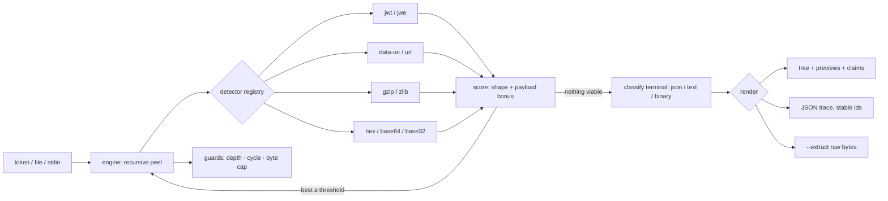

# peelback

[English](README.md) | [中文](README.zh.md) | [日本語](README.ja.md)

[](LICENSE) [](pyproject.toml) [](CHANGELOG.md)  [](CONTRIBUTING.md)

**peelback: an open-source, zero-dependency CLI and library that recursively peels base64, hex, gzip, URL and JWT layers off an opaque token — auto-detected, confidence-scored, fully offline.**


```bash
git clone https://github.com/JaydenCJ/peelback && cd peelback
pip install .    # pure standard library — nothing else comes with it
```

> Pre-release: v0.1.0 is not on PyPI yet; install from source as above (any Python ≥3.9), or run it uninstalled with `PYTHONPATH=src python3 -m peelback`.

## Why peelback?

The tokens that land in your lap during an incident — session cookies, OAuth `state` parameters, webhook signatures, cache keys — are rarely *one* encoding. They are onions: JSON, gzipped, base64url'd, then percent-escaped by whatever proxy touched them last. The tools at hand do exactly one step: `base64 -d` chokes on URL-safe alphabets and stripped padding, `xxd -r` assumes you already know it's hex, and after each step you eyeball the output and guess the next command. CyberChef's "Magic" recipe automates the guessing but lives in a browser tab — pasting a production credential into a web page is how tokens leak. peelback is that loop as one offline command: it runs eight detectors against the blob, scores each candidate by input shape *plus* how much structure the decode reveals, peels the winner, and recurses until it hits real content — printing the whole trace as a tree with per-layer confidence, JWT claims annotated, and any node's raw bytes one `--extract` away. Just as important is what it refuses: UUIDs, numeric ids and ordinary words are all "valid" base64 or hex to a naive decoder, and peelback's scoring keeps them intact instead of shredding them into garbage bytes.

| | peelback | `base64 -d` / `xxd -r` | CyberChef "Magic" | jwt.io |
|---|---|---|---|---|
| Peels nested layers automatically | ✅ recursive, auto-detected | ❌ one step, you pick it | ✅ | ❌ JWT only |
| Refuses word-shaped false positives | ✅ confidence-scored | ❌ decodes anything | ⚠️ heuristic, noisy | n/a |
| JWT structure + claim annotation | ✅ header/payload/signature | ❌ | ⚠️ via recipe steps | ✅ |
| Decompression-bomb guard | ✅ hard output cap | ❌ | ⚠️ browser memory | n/a |
| Machine-readable trace | ✅ `--json`, stable node ids | ❌ | ⚠️ manual export | ❌ |
| Safe for real credentials | ✅ offline, local process | ✅ | ❌ pasted into a browser | ❌ pasted into a browser |
| Runtime dependencies | 0 | coreutils | web app | web app |

<sub>Comparison checked 2026-07-13: peelback imports the Python standard library only; `base64`/`xxd` are single-step decoders; CyberChef and jwt.io are browser tools without shell exit codes.</sub>

## Features

- **Recursive auto-detection** — eight detectors (JWT/JWE, `data:` URIs, gzip, zlib, percent-encoding, hex, base64/base64url, base32) run at every level; the best-scoring decode is peeled and the result fed back in, until nothing recognizable remains.
- **Confidence you can read** — every layer carries a score built from the input's shape (padding, alphabet, `0x` prefix, magic bytes) plus what the decode reveals (JSON, another layer, readable text); the same asymmetry is what stops `peelback hello` from "decoding" English.
- **JWTs peeled structurally** — compact JWS splits into header, payload and signature nodes; RFC 7519 claims get human annotations (`exp … → 3000-01-01T00:00:00Z`); JWEs are handled honestly — the protected header is shown and the four encrypted segments are labelled as not peelable without keys.
- **Hostile input is survived, not trusted** — gzip/zlib inflate through a bounded decompressor (16 MiB default, `--max-bytes`), a sha256 cycle guard stops self-referential tokens, and a depth cap bounds the recursion; a token bomb yields a note, never an OOM.
- **A trace, not just an answer** — the tree shows every node with id, size and confidence plus a preview (pretty JSON, quoted text, or a hexdump); `--json` emits the same trace with stable ids and sha256 digests; `--extract --node ID` writes any node's raw bytes.
- **Shell-native** — exit code 0 means "peeled something", 1 means "already terminal", 2 means error, so `peelback "$TOKEN" >/dev/null` doubles as an is-this-encoded predicate; `NO_COLOR` and `--no-color` are honored.
- **Zero dependencies, fully offline** — Python standard library only; no network, no telemetry. Tokens are secrets, and secrets stay on your machine.

## Quickstart

```bash
pip install .    # or: alias peelback='PYTHONPATH=src python3 -m peelback'
peelback 'H4sIAAAAAAACA6tWKi1OLVKyUlBKzE0sSlTSUVAqys9JLQaKRCslpuRm5oGE8guKlWKBdHFqcXFmfh5IuWWaRaKuuXmyEUi-ODGnBChoUAsA2RMtdk8AAAA%3D'
```

Real captured output — three layers found and peeled, no flags needed:

```text
peelback · peeled 3 layers · input 122 B

#0 · input · 122 B
└─ #1 · url-encoding · 120 B · (0.85)
   · 1 percent escape(s)
   └─ #2 · base64url · 89 B · (0.99)
      └─ #3 · gzip · json · 79 B · (0.99)
         {
           "roles": [
             "admin",
             "ops"
           ],
           "salt": 0,
           "session": "9f8a-77c2",
           "user": "amara"
         }
```

Feed it a JWT (line 15 of [`examples/sample-tokens.txt`](examples/sample-tokens.txt)) and the three segments become nodes, with claims annotated (real output, captured 2026-07-13):

```text
peelback · peeled 1 layer · input 199 B

#0 · input · 199 B
├─ #1 · jwt header · json · 27 B · (0.97)
│  · alg=HS256
│  {
│    "alg": "HS256",
│    "typ": "JWT"
│  }
├─ #2 · jwt payload · json · 88 B
│  {
│    "exp": 32503680000,
│    "iat": 1700000000,
│    "iss": "https://auth.example.test",
│    "sub": "user-4821"
│  }
│  — claims —
│  iss (issuer): "https://auth.example.test"
│  sub (subject): "user-4821"
│  exp (expires at): 32503680000 → 3000-01-01T00:00:00Z  [expires in 355552d]
│  iat (issued at): 1700000000 → 2023-11-14T22:13:20Z  [971d ago]
└─ #3 · jwt signature · binary · 32 B
   00000000  70 4f d9 d6 43 1e b2 e5 60 f9 4b 2a d4 f4 8c 18  |pO..C...`.K*....|
   00000010  e2 ea 3f 30 fe 17 f4 84 71 d7 11 c7 aa 56 e6 cf  |..?0....q....V..|
```

Then pull the innermost payload out as raw bytes for the next tool in the pipe:

```bash
peelback --extract "$TOKEN" | jq .user     # innermost payload, byte-exact
peelback --json "$TOKEN" > trace.json      # the whole trace, machine-readable
```

## Detectors

`peelback --list-detectors` prints this table; `--only` and `--skip` take the ids. Detectors are pure functions — input shape sets the base confidence, and the engine adds a bonus for what the decode reveals.

| Id | Recognizes | Notes |
|---|---|---|
| `jwt` | compact JWS and JWE | splits into header/payload/signature; JWE header only |
| `data-uri` | RFC 2397 `data:` URIs | base64 and percent-encoded bodies, media type noted |
| `gzip` | gzip members (RFC 1952) | magic bytes; bomb-guarded; trailing bytes tolerated |
| `zlib` | zlib streams (RFC 1950) | weak 2-byte header, so it leans on the payload bonus |
| `url` | percent-encoding | fires only on real `%XX` escapes |
| `hex` | hexadecimal | `0x` prefixes, `:`/whitespace separators; all-digit strings demoted |
| `base64` | base64 + base64url | padded or not; refuses UUIDs and short word-shaped strings |
| `base32` | RFC 4648 base32 | deliberately timid — must earn its place via the payload |

## CLI reference

`peelback [token] [flags]` — token as an argument, `--file PATH`, or stdin. Exit codes: **0** peeled at least one layer, **1** nothing to peel, **2** usage or input error.

| Flag | Default | Effect |
|---|---|---|
| `--json` | off | emit the full trace as JSON (stable node ids, sha256 per node) |
| `-x, --extract` | off | write raw payload bytes instead of the tree (innermost by default) |
| `--node ID` | deepest leaf | with `--extract`: which node to write (ids match the tree) |
| `-o, --out PATH` | stdout | with `--extract`: write bytes to a file |
| `--max-depth N` | `16` | recursion cap across layers |
| `--max-bytes N` | `16777216` | decompression output cap (the bomb guard) |
| `--min-confidence F` | `0.55` | detection threshold; raise it to peel more conservatively |
| `--only` / `--skip LIST` | all detectors | comma-separated detector ids to use exclusively / disable |
| `--no-color` | auto | disable ANSI colors (also honors `NO_COLOR` and non-TTY) |

## Verification

This repository ships no CI; every claim above is verified by local runs:

```bash
python3 -m pytest        # 93 deterministic tests, offline, < 1 s
bash scripts/smoke.sh    # end-to-end CLI check, prints SMOKE OK
```

## Architecture



## Roadmap

- [x] v0.1.0 — recursive engine with confidence scoring, 8 detectors (JWT/JWE, data-URI, gzip, zlib, url, hex, base64/url, base32), claim annotation, bomb/cycle/depth guards, tree + JSON + extract output, 93 tests + smoke script
- [ ] More layers: base85/ascii85, quoted-printable, MessagePack and CBOR terminals
- [ ] `--all-candidates` mode showing every viable decode at each level, not just the winner
- [ ] Scan mode: extract and peel every token-shaped substring found in a log or HAR file
- [ ] Color themes and a `--max-preview` knob for the tree renderer
- [ ] Python API docs on a static site, generated from the docstrings

See the [open issues](https://github.com/JaydenCJ/peelback/issues) for the full list.

## Contributing

Issues, discussions and pull requests are welcome — see [CONTRIBUTING.md](CONTRIBUTING.md) for the local workflow (format, lint, tests, `SMOKE OK`). Good entry points are labelled [good first issue](https://github.com/JaydenCJ/peelback/issues?q=is%3Aissue+is%3Aopen+label%3A%22good+first+issue%22), and design questions live in [Discussions](https://github.com/JaydenCJ/peelback/discussions).

## License

[MIT](LICENSE)
