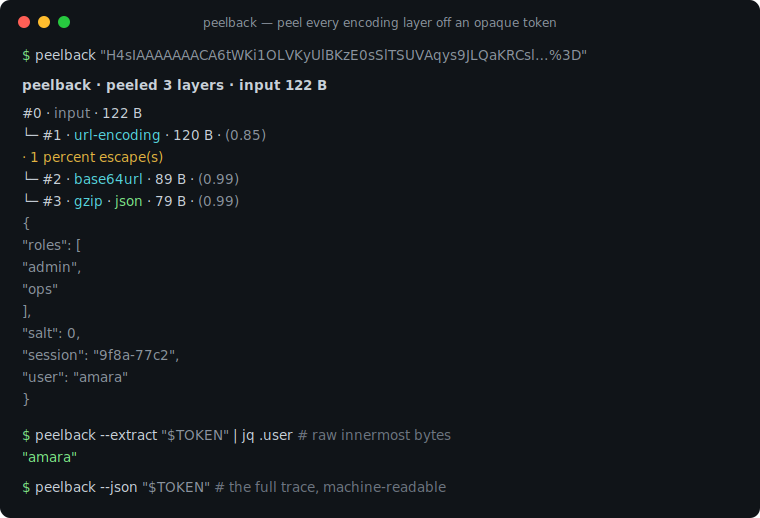
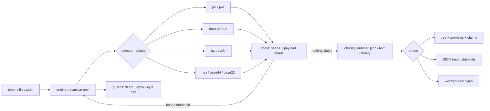

# peelback

[English](README.md) | [中文](README.zh.md) | [日本語](README.ja.md)

[](LICENSE) [](pyproject.toml) [](CHANGELOG.md)  [](CONTRIBUTING.md)

**peelback：开源、零依赖的 CLI 与库，递归剥开不透明 token 上的 base64、hex、gzip、URL 和 JWT 编码层——自动检测、置信度评分、完全离线。**



```bash
git clone https://github.com/JaydenCJ/peelback && cd peelback
pip install .    # pure standard library — nothing else comes with it
```

> 预发布：v0.1.0 尚未上 PyPI；请按上面的方式从源码安装（任意 Python ≥3.9），或不安装直接运行 `PYTHONPATH=src python3 -m peelback`。

## 为什么选 peelback？

排障时落到你手里的 token——会话 cookie、OAuth `state` 参数、webhook 签名、缓存键——很少只有*一层*编码。它们是洋葱：JSON 先被 gzip，再 base64url，最后被路上随便哪个代理做了百分号转义。手边的工具每次只能剥一步：`base64 -d` 遇到 URL-safe 字母表和被去掉的 padding 就报错，`xxd -r` 假设你早已知道它是 hex，每剥一步你还得肉眼判断输出、猜下一条命令。CyberChef 的 "Magic" 配方能自动猜，但它活在浏览器标签页里——把生产环境凭证粘进网页正是 token 泄露的经典方式。peelback 把这个循环做成一条离线命令：对 blob 跑八个检测器，按输入形状*加上*解码揭示了多少结构给每个候选打分，剥掉赢家后递归，直到碰到真正的内容——整条轨迹渲染成一棵树，每层带置信度，JWT claims 自动注解，任意节点的原始字节一个 `--extract` 就能取出。同样重要的是它拒绝什么：UUID、数字 id 和普通单词对朴素解码器来说都是"合法"的 base64 或 hex，peelback 的评分让它们保持原样，而不是被搅成垃圾字节。

| | peelback | `base64 -d` / `xxd -r` | CyberChef "Magic" | jwt.io |
|---|---|---|---|---|
| 自动剥开嵌套层 | ✅ 递归、自动检测 | ❌ 一次一步，自己选 | ✅ | ❌ 仅 JWT |
| 拒绝形似单词的误报 | ✅ 置信度评分 | ❌ 什么都解 | ⚠️ 启发式，噪声大 | n/a |
| JWT 结构 + claim 注解 | ✅ header/payload/signature | ❌ | ⚠️ 需手搭配方 | ✅ |
| 解压炸弹防护 | ✅ 硬性输出上限 | ❌ | ⚠️ 受限于浏览器内存 | n/a |
| 机器可读的轨迹 | ✅ `--json`，节点 id 稳定 | ❌ | ⚠️ 手动导出 | ❌ |
| 可安全处理真实凭证 | ✅ 离线本地进程 | ✅ | ❌ 粘进浏览器 | ❌ 粘进浏览器 |
| 运行时依赖 | 0 | coreutils | 网页应用 | 网页应用 |

<sub>对比核对于 2026-07-13：peelback 只 import Python 标准库；`base64`/`xxd` 是单步解码器；CyberChef 与 jwt.io 是浏览器工具，没有 shell 退出码。</sub>

## 特性

- **递归自动检测** — 八个检测器（JWT/JWE、`data:` URI、gzip、zlib、百分号编码、hex、base64/base64url、base32）在每一层全部出动；得分最高的解码被剥开，结果再喂回去，直到再无可识别的层。
- **看得懂的置信度** — 每层的分数由输入形状（padding、字母表、`0x` 前缀、magic 字节）加上解码揭示的内容（JSON、又一层编码、可读文本）构成；正是这种不对称让 `peelback hello` 不会把英语单词"解码"掉。
- **JWT 按结构剥开** — 紧凑 JWS 拆成 header、payload、signature 三个节点；RFC 7519 claims 带人类可读注解（`exp … → 3000-01-01T00:00:00Z`）；对 JWE 保持诚实——只展示 protected header，四个加密段标注为无密钥不可剥。
- **恶意输入被扛住，而不是被信任** — gzip/zlib 经由有界解压器膨胀（默认 16 MiB，`--max-bytes`），sha256 循环守卫拦下自指 token，深度上限约束递归；token 炸弹只会得到一条备注，绝不会 OOM。
- **给你轨迹，不只是答案** — 树上每个节点带 id、大小、置信度和预览（美化 JSON、带引号文本或 hexdump）；`--json` 输出同一轨迹，id 稳定且每节点带 sha256；`--extract --node ID` 写出任意节点的原始字节。
- **为 shell 而生** — 退出码 0 表示"剥到了"，1 表示"已是终点"，2 表示错误，所以 `peelback "$TOKEN" >/dev/null` 可以直接当"这东西编码过吗"的判断用；支持 `NO_COLOR` 与 `--no-color`。
- **零依赖，完全离线** — 只用 Python 标准库；无网络、无遥测。token 就是秘密，秘密只留在你的机器上。

## 快速上手

```bash
pip install .    # or: alias peelback='PYTHONPATH=src python3 -m peelback'
peelback 'H4sIAAAAAAACA6tWKi1OLVKyUlBKzE0sSlTSUVAqys9JLQaKRCslpuRm5oGE8guKlWKBdHFqcXFmfh5IuWWaRaKuuXmyEUi-ODGnBChoUAsA2RMtdk8AAAA%3D'
```

真实抓取的输出——三层全部找到并剥开，无需任何参数：

```text
peelback · peeled 3 layers · input 122 B

#0 · input · 122 B
└─ #1 · url-encoding · 120 B · (0.85)
   · 1 percent escape(s)
   └─ #2 · base64url · 89 B · (0.99)
      └─ #3 · gzip · json · 79 B · (0.99)
         {
           "roles": [
             "admin",
             "ops"
           ],
           "salt": 0,
           "session": "9f8a-77c2",
           "user": "amara"
         }
```

喂给它一个 JWT（[`examples/sample-tokens.txt`](examples/sample-tokens.txt) 第 15 行），三段各自成节点，claims 自动注解（真实输出，抓取于 2026-07-13）：

```text
peelback · peeled 1 layer · input 199 B

#0 · input · 199 B
├─ #1 · jwt header · json · 27 B · (0.97)
│  · alg=HS256
│  {
│    "alg": "HS256",
│    "typ": "JWT"
│  }
├─ #2 · jwt payload · json · 88 B
│  {
│    "exp": 32503680000,
│    "iat": 1700000000,
│    "iss": "https://auth.example.test",
│    "sub": "user-4821"
│  }
│  — claims —
│  iss (issuer): "https://auth.example.test"
│  sub (subject): "user-4821"
│  exp (expires at): 32503680000 → 3000-01-01T00:00:00Z  [expires in 355552d]
│  iat (issued at): 1700000000 → 2023-11-14T22:13:20Z  [971d ago]
└─ #3 · jwt signature · binary · 32 B
   00000000  70 4f d9 d6 43 1e b2 e5 60 f9 4b 2a d4 f4 8c 18  |pO..C...`.K*....|
   00000010  e2 ea 3f 30 fe 17 f4 84 71 d7 11 c7 aa 56 e6 cf  |..?0....q....V..|
```

然后把最内层 payload 按原始字节取出，交给管道里的下一个工具：

```bash
peelback --extract "$TOKEN" | jq .user     # innermost payload, byte-exact
peelback --json "$TOKEN" > trace.json      # the whole trace, machine-readable
```

## 检测器

`peelback --list-detectors` 打印这张表；`--only` 和 `--skip` 接受这些 id。检测器都是纯函数——输入形状定基础置信度，引擎再按解码揭示的内容加分。

| Id | 识别对象 | 说明 |
|---|---|---|
| `jwt` | 紧凑 JWS 与 JWE | 拆成 header/payload/signature；JWE 只取 header |
| `data-uri` | RFC 2397 `data:` URI | base64 与百分号编码体，media type 记入备注 |
| `gzip` | gzip 成员（RFC 1952） | magic 字节；带炸弹防护；容忍尾部多余字节 |
| `zlib` | zlib 流（RFC 1950） | 2 字节头证据弱，主要靠 payload 加分 |
| `url` | 百分号编码 | 只在存在真实 `%XX` 转义时触发 |
| `hex` | 十六进制 | 支持 `0x` 前缀、`:`/空白分隔符；全数字串降分 |
| `base64` | base64 + base64url | 有无 padding 皆可；拒绝 UUID 与形似单词的短串 |
| `base32` | RFC 4648 base32 | 刻意保守——必须靠 payload 证明自己 |

## CLI 参考

`peelback [token] [flags]` — token 走参数、`--file PATH` 或 stdin。退出码：**0** 至少剥开一层，**1** 无可剥，**2** 用法或输入错误。

| 参数 | 默认值 | 效果 |
|---|---|---|
| `--json` | 关 | 以 JSON 输出完整轨迹（节点 id 稳定，每节点带 sha256） |
| `-x, --extract` | 关 | 输出原始 payload 字节而非树（默认取最内层） |
| `--node ID` | 最深叶子 | 配合 `--extract`：写出哪个节点（id 与树一致） |
| `-o, --out PATH` | stdout | 配合 `--extract`：把字节写入文件 |
| `--max-depth N` | `16` | 跨层递归上限 |
| `--max-bytes N` | `16777216` | 解压输出上限（炸弹防护） |
| `--min-confidence F` | `0.55` | 检测阈值；调高则剥得更保守 |
| `--only` / `--skip LIST` | 全部检测器 | 逗号分隔的检测器 id，独占启用 / 禁用 |
| `--no-color` | 自动 | 关闭 ANSI 颜色（同时尊重 `NO_COLOR` 与非 TTY） |

## 验证

本仓库不带 CI；上面的每一条主张都由本地运行验证：

```bash
python3 -m pytest        # 93 deterministic tests, offline, < 1 s
bash scripts/smoke.sh    # end-to-end CLI check, prints SMOKE OK
```

## 架构



## 路线图

- [x] v0.1.0 — 带置信度评分的递归引擎、8 个检测器（JWT/JWE、data-URI、gzip、zlib、url、hex、base64/url、base32）、claim 注解、炸弹/循环/深度守卫、树 + JSON + extract 输出、93 个测试 + smoke 脚本
- [ ] 更多层：base85/ascii85、quoted-printable，以及 MessagePack 和 CBOR 终点识别
- [ ] `--all-candidates` 模式：展示每层所有可行解码，而不只是赢家
- [ ] 扫描模式：从日志或 HAR 文件中提取并剥开每个形似 token 的子串
- [ ] 树渲染器的配色主题与 `--max-preview` 旋钮
- [ ] 由 docstring 生成的 Python API 文档静态站点

完整列表见 [open issues](https://github.com/JaydenCJ/peelback/issues)。

## 参与贡献

欢迎 issue、讨论与 pull request——本地工作流（格式化、lint、测试、`SMOKE OK`）见 [CONTRIBUTING.md](CONTRIBUTING.md)。入门任务标注为 [good first issue](https://github.com/JaydenCJ/peelback/issues?q=is%3Aissue+is%3Aopen+label%3A%22good+first+issue%22)，设计讨论在 [Discussions](https://github.com/JaydenCJ/peelback/discussions)。

## 许可证

[MIT](LICENSE)
